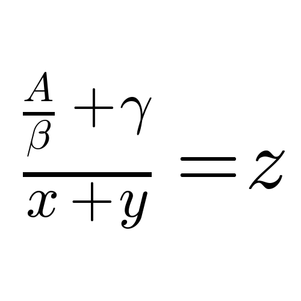

# Latex Image to Code

Converts a mathematical image to latex code. First, it finds each symbol
in the image and uses a convolutional neural network to determine what
symbol it is. Once each symbol is identified, it puts back together the
latex code based on positions and sizes.

# Package Dependencies

- cv2
- nolearn/lasagne
- numpy
- pandas
- ipython
- matplotlib
- cPickle
- Flask

# Examples

Input 1:

Output 1: "\frac{\frac{A}{\beta}+\gamma}{x+y}=z"

Input 2:

Output 2: "yA_{Ay}^{xy}"

# Files

- code/generate_images.py: Contains functions to generate every symbol.
Used for training the neural net for symbol recognition.
- code/model.py: The neural network used for symbol recognition.
- code/Latex2Code.py: The class to put together the symbols to a latex
code string.
- webapp/: Folder containing code to launch a Flask webapp.
